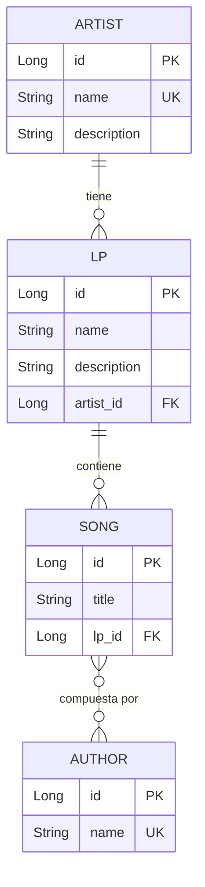

# Discography

[](https://github.com/Toleflaco/discography-coditramuntana/actions/workflows/ci.yml)

**Java 21 · Spring Boot 4 · H2 (file mode) · Flyway · JaCoCo · GitHub Actions**

Prueba técnica para Coditramuntana. API REST para gestionar una discografía
organizada por artistas, LPs, canciones y autores, con un endpoint de reporte
agregado. Incluye una interfaz web mínima servida por Spring para probar los
endpoints sin herramientas externas.

Los errores se devuelven como `ProblemDetail` RFC 7807, la documentación
interactiva está disponible en Swagger UI, y la paginación aplica un guard
clause por defecto para garantizar orden estable entre peticiones.

## Tech stack

- **Java 21** — records, pattern matching, texto multilínea.
- **Spring Boot 4.1** — framework de aplicación e inyección de dependencias.
- **Spring Data JPA + Hibernate 7** — ORM, `@EntityGraph`/JOIN FETCH para
  prevenir N+1.
- **H2 Database (file mode)** — persistencia local con fichero
  `data/discography.mv.db`. Portable a PostgreSQL sin cambios en el código
  (ver [ADR-002](docs/adr/002-h2-postgresql-portability.md)).
- **Flyway** — migraciones versionadas del esquema, `ddl-auto: validate`.
- **springdoc-openapi 3.1.0** — Swagger UI generado a partir de las
  anotaciones.
- **JUnit 5 + Mockito (estilo BDDMockito) + AssertJ** — tests unitarios y
  de integración.
- **MockMvc + `@WebMvcTest`** — tests de integración de la capa web.
- **JaCoCo 0.8.12** — cobertura de código con reporte HTML.
- **GitHub Actions** — CI en cada push a `main` y en cada pull request.
- **Pico.css classless (CDN)** — CSS del frontend sin clases.
- **Maven Wrapper** — build reproducible sin instalación previa de Maven.

## Architecture

El código está organizado por dominio, no por capa técnica:
```
com.coditramuntana.discography
├── artist       — Artist entity, repository, service, controller, DTOs, exceptions
├── lp           — Lp entity + toda la vertical de LP
├── song         — Song entity + repositorio
├── author       — Author entity + repositorio
├── report       — DiscographyReportService + endpoint agregado
├── shared/error — GlobalExceptionHandler + jerarquía polimórfica de excepciones
├── shared/config — WebConfig, pageable serialization
└── seed         — DataSeeder para arranque en local
```


Cada paquete contiene su vertical completa: entidad, repositorio, servicio,
controlador, DTOs y excepciones específicas del dominio. Un desarrollador
que trabaje sobre `artist` no necesita saltar entre paquetes técnicos para
completar un cambio.

Los servicios devuelven DTOs, no entidades. La conversión se hace mediante
un método estático `from(...)` en cada DTO, sin dependencia de MapStruct
(ver "Roadmap").

Las decisiones arquitectónicas con más peso están documentadas como ADRs
en formato Nygard:

- [ADR-001: Elección del stack](docs/adr/001-stack-choice.md)
- [ADR-002: Portabilidad H2 → PostgreSQL](docs/adr/002-h2-postgresql-portability.md)
- [ADR-003: Política de errores REST con ProblemDetail RFC 7807](docs/adr/003-rest-error-policy.md)

## Domain model



Reglas de dominio relevantes:

- **Artist ↔ LP**: relación 1-a-N. Un LP pertenece a un único artista, y la
  asignación es inmutable (no se puede reasignar un LP a otro artista tras
  crearlo).
- **LP ↔ Song**: relación 1-a-N con cascade en operaciones de creación.
- **Song ↔ Author**: relación N-a-M. Un autor puede colaborar en canciones
  de artistas distintos (compartido vía `AuthorRepository.findByName` en la
  seed).
- **Uniqueness**: `Artist.name` único global; `Lp.name` único dentro del
  scope de cada artista (`(artist_id, name)`).

## Getting started

### Requisitos

- JDK 21 (Temurin recomendado).
- No hace falta instalar Maven — el proyecto incluye el wrapper `./mvnw`.
- No hace falta instalar base de datos — H2 en file mode se crea al arrancar
  en el directorio `data/`.

### Arrancar la aplicación

```bash
git clone https://github.com/Toleflaco/discography-coditramuntana.git
cd discography-coditramuntana
./mvnw spring-boot:run
```

La aplicación arranca en `http://localhost:8080`. En el primer arranque, el
`DataSeeder` puebla la base de datos con **25 artistas, 45 LPs y ~130
canciones** para poder probar la paginación de forma realista. En arranques
posteriores el seed se salta automáticamente (guardia sobre `count() > 0`).

### Explorar el sistema

- **Frontend web**: [http://localhost:8080/](http://localhost:8080/) — home
  con navegación a Artistas, LPs y Reporte. Es una UI mínima pero completa
  (CRUD, filtro, paginación, ProblemDetail renderizado bajo cada campo).
- **Swagger UI**: [http://localhost:8080/swagger-ui/index.html](http://localhost:8080/swagger-ui/index.html)
  — documentación interactiva de los endpoints, generada desde las
  anotaciones OpenAPI.
- **Especificación OpenAPI**: `http://localhost:8080/v3/api-docs`
- **H2 Console**: `http://localhost:8080/h2-console`
    - JDBC URL: `jdbc:h2:file:./data/discography;AUTO_SERVER=TRUE`
    - User: `sa`, sin contraseña.

## API endpoints

### Artists

| Método | Path | Descripción |
| --- | --- | --- |
| `GET` | `/api/artists` | Listado paginado |
| `GET` | `/api/artists/{id}` | Detalle con `lpCount` |
| `POST` | `/api/artists` | Crear artista |
| `PUT` | `/api/artists/{id}` | Actualizar artista |
| `DELETE` | `/api/artists/{id}` | Borrar (409 si tiene LPs asociados) |

### LPs

| Método | Path | Descripción |
| --- | --- | --- |
| `GET` | `/api/lps?artistName={name}` | Listado paginado con filtro opcional por nombre de artista |
| `GET` | `/api/lps/{id}` | Detalle con `songCount` |
| `POST` | `/api/lps` | Crear LP asociado a un artista |
| `PUT` | `/api/lps/{id}` | Actualizar (name y description; artista es inmutable) |
| `DELETE` | `/api/lps/{id}` | Borrar |

### Report

| Método | Path | Descripción |
| --- | --- | --- |
| `GET` | `/api/reports/discography` | Reporte agregado paginado: `lpName`, `artistName`, `songCount`, `authorsCsv` (autores únicos ordenados alfabéticamente) |

Todos los listados aceptan parámetros de paginación estándar de Spring Data:
`?page=0&size=10&sort=name,asc`. Cuando el cliente no manda `sort`, cada
servicio aplica un sort por defecto para garantizar orden estable entre
peticiones (guard clause).

Los errores se devuelven como `ProblemDetail` RFC 7807 con extensiones
custom (`resourceType`, `resourceId`, `fieldErrors`). Ver
[ADR-003](docs/adr/003-rest-error-policy.md).

## Testing

```bash
./mvnw verify
```

**44 tests verdes**, en dos capas:

- **28 tests unitarios de servicios** (`ArtistServiceTest`, `LpServiceTest`,
  `DiscographyReportServiceTest`): verifican decisiones de negocio con mocks
  de repositorios. Estructurados con `@Nested` por método bajo test y
  `@DisplayName` para reportes legibles. Uso de `ArgumentCaptor<Pageable>`
  para verificar el guard clause del sort por defecto.
- **16 tests de integración de controladores** (`ArtistControllerTest`,
  `LpControllerTest`, `ReportControllerTest`): con `@WebMvcTest` +
  `@MockitoBean` + MockMvc. Verifican el contrato HTTP: rutas, status
  codes, headers (`Location` en 201), payloads JSON y el mapeo de excepciones
  a `ProblemDetail` por el `GlobalExceptionHandler`.

Estilo: BDDMockito (`given()` / `then().should()`) por coherencia con
[task-manager-api](https://github.com/Toleflaco/task-manager-api), y por
ser más natural para tests que documentan comportamiento.

### Cobertura

JaCoCo genera un reporte HTML en `target/site/jacoco/index.html` tras
`./mvnw verify`. Cobertura actual en paquetes de negocio: **79%
instrucciones, 43% branches**. Se excluyen del reporte
`DiscographyApplication` (main de Spring Boot sin lógica) y el paquete
`seed` (scaffolding de arranque).

El plugin no aplica quality gate (`haltOnFailure=false` por defecto). Un
umbral con capacidad real de detectar regresiones requiere baseline
histórico del proyecto — establecerlo en el primer commit sería arbitrario.

## Continuous Integration

GitHub Actions ejecuta `./mvnw verify` en cada push a `main` y en cada
pull request. El pipeline sube el reporte HTML de JaCoCo como artefacto
descargable durante 7 días. Runner pinned a `ubuntu-22.04` para
estabilidad. Ver [`.github/workflows/ci.yml`](.github/workflows/ci.yml).

## Roadmap / posibles mejoras

Decisiones conscientes de dejar fuera del scope para esta iteración, con
motivo explícito para cada una:

- **Docker + Docker Compose**: la aplicación funciona con `./mvnw
  spring-boot:run` sin dependencias externas gracias a H2 en file mode.
  Contenedorizar añade valor cuando hay dependencias externas (PostgreSQL,
  Redis, etc.) que orquestar.
- **Spring Security + autenticación**: fuera del scope del enunciado. La API
  expone todos los endpoints sin control de acceso.
- **PostgreSQL con Testcontainers**: la portabilidad está documentada
  (ADR-002) pero los tests de integración de repositorio contra una BD real
  no están escritos. Es el siguiente paso natural si el proyecto evoluciona.
- **MapStruct**: la conversión entidad ↔ DTO se hace con métodos estáticos
  `from(...)`. Introducir MapStruct tiene sentido cuando el número de DTOs
  y las transformaciones justifican el coste de una dependencia adicional
  y la configuración del compilador.
- **Quality gate en JaCoCo**: requiere baseline histórico; se establece
  tras 2-3 iteraciones cuando la horquilla de cobertura estabiliza.
- **Frontend con framework** (React/Vue): la UI actual es HTML + JS vanilla
    + Pico.css classless. Para una aplicación mayor con estado compartido y
      navegación compleja, un framework aportaría estructura. Aquí sería
      sobredimensionado.

## Author

**Manuel Toledano** ([@Toleflaco](https://github.com/Toleflaco))

Backend developer. Prueba técnica realizada como parte del proceso de
selección de Coditramuntana.
